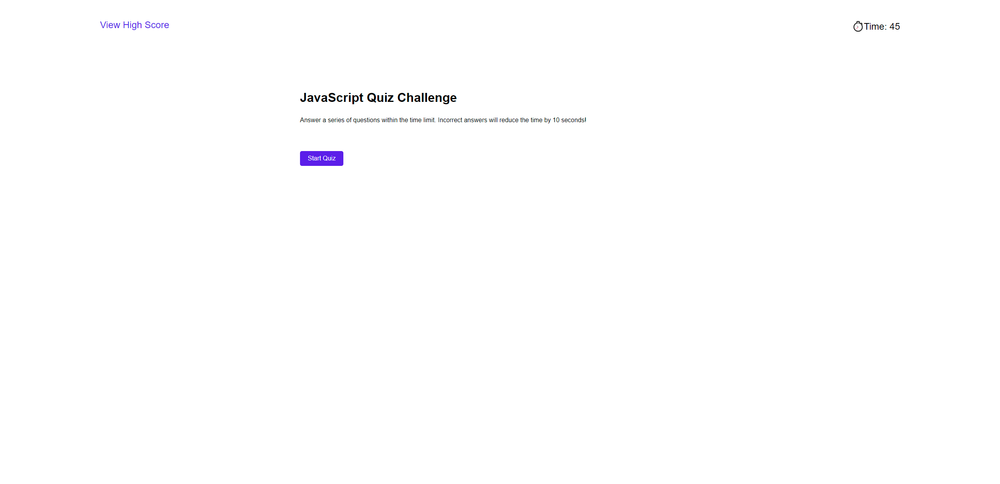
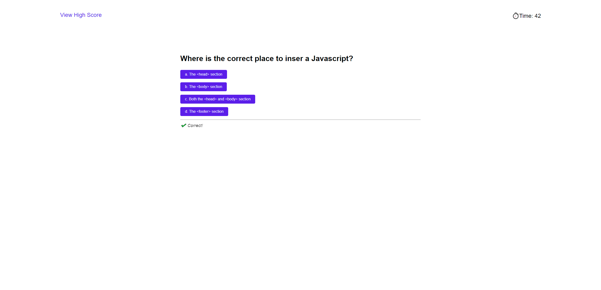

# w4-js-code-quiz

## Description

This is a timed, multiple-choice quiz game about JavaScript.

## Installation

N/A

## Usage

Access the webpage using the deployed link [HERE](https://trahy.github.io/w4-js-code-quiz/).

The objective of the game is to answer a total of 10 questions within 45 seconds.

1. Click "Start Quiz" when ready
* The timer, on the top-right corner, will begin to count down
* Click on "View High Score" to view the scoreboard

2. A series of multiple-choice questions is presented
* For every *correct* answer is a single point
* For every *incorrect* answer is a 10 second penalty
* After answering a question, the answer will be marked as correct or incorrect. If incorrect, the correct answer will be displayed

3. Game is suspended when all questions are answered or the timer reaches 0

4. When game is complete, the final score is given and the user can enter their initials and "Submit" to save their score to a local storage

5. The data is presented to the High Score page

6. User has the option to "Go Back" to start quiz again or "Clear" their scores

## Usage

## Credits

Questions from this quiz has been sourced from the following link:

https://www.w3schools.com/js/js_quiz.asp

## License

Please refer to the LICENSE in the repo.

---